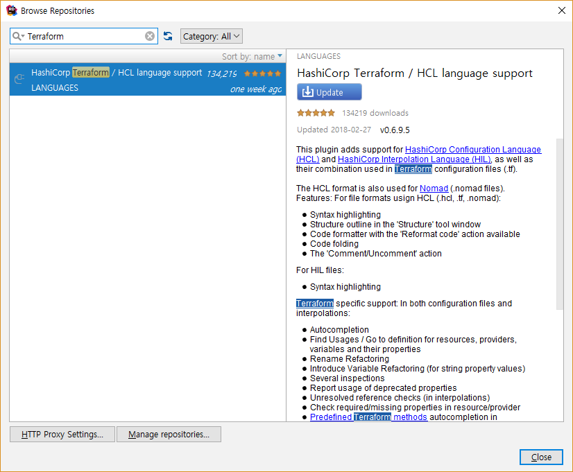
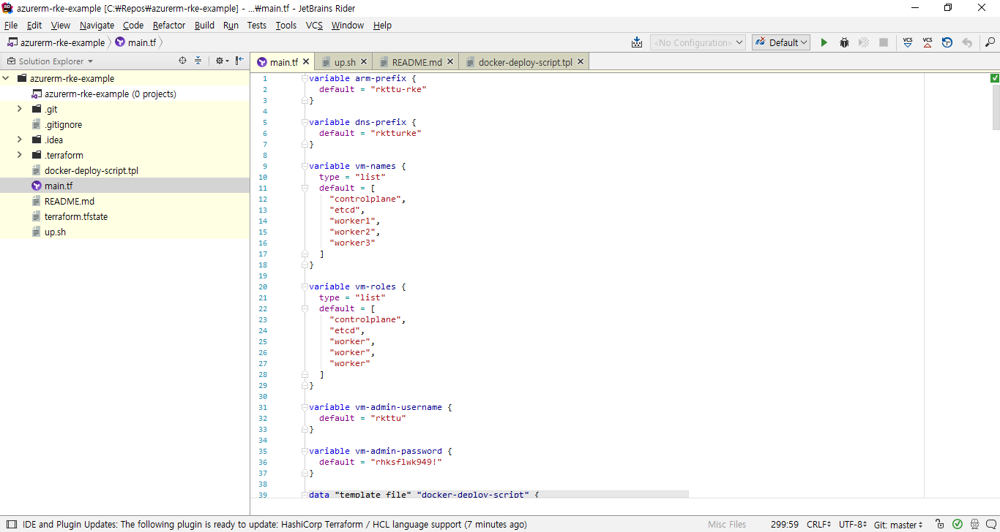

# 1. 필요한 소프트웨어 설치 및 준비

## 1.1. 필요한 소프트웨어 설치 및 준비

이번 Hands-on-Lab을 진행하기 위해서는 다음의 소프트웨어를 사전에 설치하는 것을 권장합니다.

- JetBrains IDE (ReSharper 제외) 중 하나를 선택합니다. 보유하고 있는 IDE가 없을 경우 무료로 사용할 수 있는 Android Studio나 IntelliJ Community Edition도 실습에 사용할 수 있습니다.
- Git CLI를 설치합니다. Windows 환경인 경우 Git for Windows를 설치합니다.
- SSH Client를 설치합니다. 별도의 프로그램이 없을 경우, Windows 환경인 경우에는 무료로 사용할 수 있는 PuTTY를 권장합니다.

## 1.2. 각 소프트웨어 설치 링크

- [IntelliJ Community Edition](https://www.jetbrains.com/idea/download/)
- [Git for Windows](https://git-scm.com/download/)
- [PuTTY Client](https://www.chiark.greenend.org.uk/~sgtatham/putty/latest.html)

## 1.3. Terraform Plugin 설치

JetBrains IDE 중 주로 사용하는 IDE를 하나 선택하여 Terraform Plugin을 설치합니다.

1. IDE에서 새 프로젝트를 만든 다음, `File` 메뉴 -> `Settings` 메뉴를 클릭합니다.

2. 좌측 메뉴들 중 `Plugins` 항목 선택 -> `Browse Repositories` 버튼을 클릭합니다.
   

3. 플러그인 검색란에서 `Terraform`을 입력합니다.

4. 나타나는 검색 결과에서 `HashiCorp Terraform / HCL language support` 플러그인을 설치하고 IDE를 다시 시작합니다.
   

5. Terraform 플러그인이 정상적으로 설치되었는지 확인하기 위하여, 프로젝트에 새 파일로 확장자가 `.tf`인 텍스트 파일을 만들고 아래 그림과 같이 Terraform 코드를 입력했을 때 문법 강조기가 잘 동작하는지 확인합니다.
   
