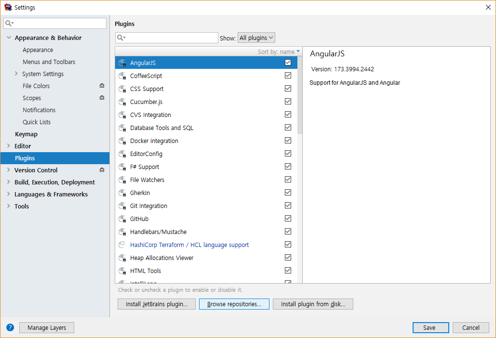
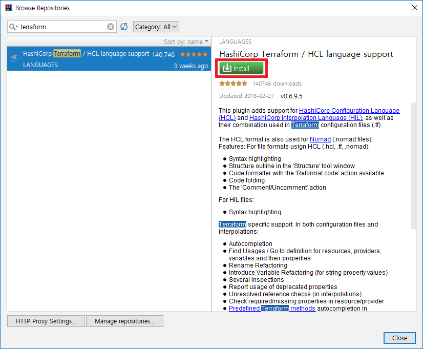
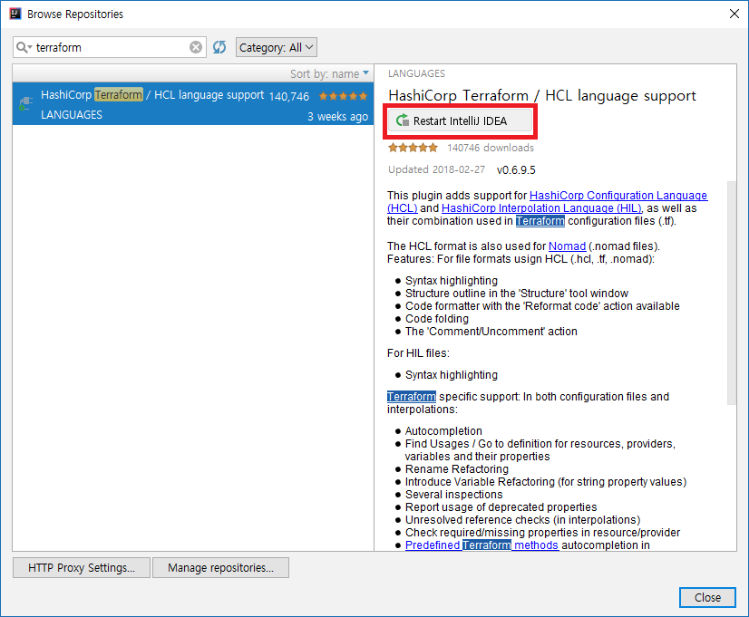

# 1. 필요한 소프트웨어 설치 및 준비

실습에 필요한 소프트웨어를 설치하고 준비하는 과정을 살펴보겠습니다.

## 1.1. 소프트웨어에 대한 설명

이번 Hands-on-Lab을 진행하기 위해서는 다음의 소프트웨어를 사전에 설치하는 것을 권장합니다.

- IntelliJ Community Edition과 Terraform Plugin이 필요합니다. (만약 Resharper를 제외한 JetBrains의 Java 기반 IDE를 사용 중인 것이 있다면 해당 IDE를 대신 사용해도 무방합니다.)
- Git CLI를 설치합니다. Windows 환경인 경우 Git for Windows를 설치해야 하며, mac OS의 경우 XCode 개발자 패키지를 설치해야 합니다.
- SSH Client를 설치합니다. 별도의 프로그램이 없을 경우, Windows 환경인 경우에는 무료로 사용할 수 있는 PuTTY를 권장합니다. Windows 10 RS4 이상의 운영 체제에서는 내장된 `ssh.exe` 유틸리티를 사용하여 접속할 수 있습니다.

## 1.2. 각 소프트웨어 설치 링크

- [IntelliJ Community Edition](https://www.jetbrains.com/idea/download/)
- [Git for Windows](https://git-scm.com/download/)
- [PuTTY Client](https://www.chiark.greenend.org.uk/~sgtatham/putty/latest.html)

## 1.3. Terraform Plugin 설치

JetBrains IDE 중 주로 사용하는 IDE를 하나 선택하여 Terraform Plugin을 설치합니다. 여기서는 IntelliJ Communtiy Edition을 기준으로 설명을 진행하겠습니다.

1.3.1. IDE에서 새 프로젝트를 만든 다음, `File` 메뉴 -> `Settings` 메뉴를 클릭합니다.

1.3.2. 좌측 메뉴들 중 `Plugins` 항목 선택 -> `Browse Repositories` 버튼을 클릭합니다.

1.3.3. 플러그인 검색란에서 `Terraform`을 입력합니다.

1.3.4. 나타나는 검색 결과에서 `HashiCorp Terraform / HCL language support` 플러그인을 선택하고, 상세 보기에서 `Install` 버튼을 클릭합니다.

1.3.5. 그 다음, IDE를 다시 시작하도록 합니다.

이제 다음 모듈로 넘어가서 Azure 환경 위에서 Terraform을 사용하는 기본 방법을 학습해보도록 하겠습니다.
