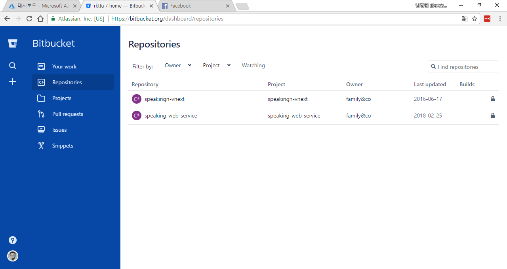
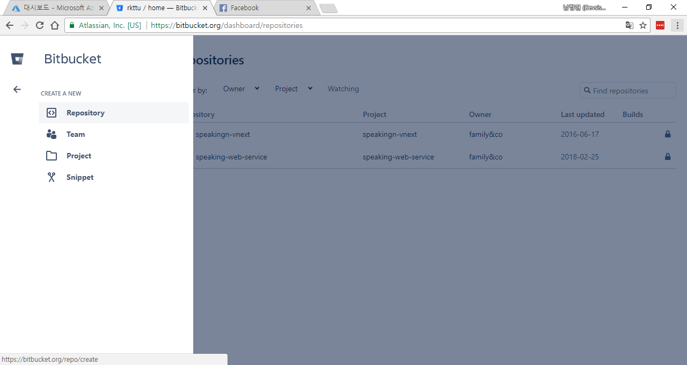
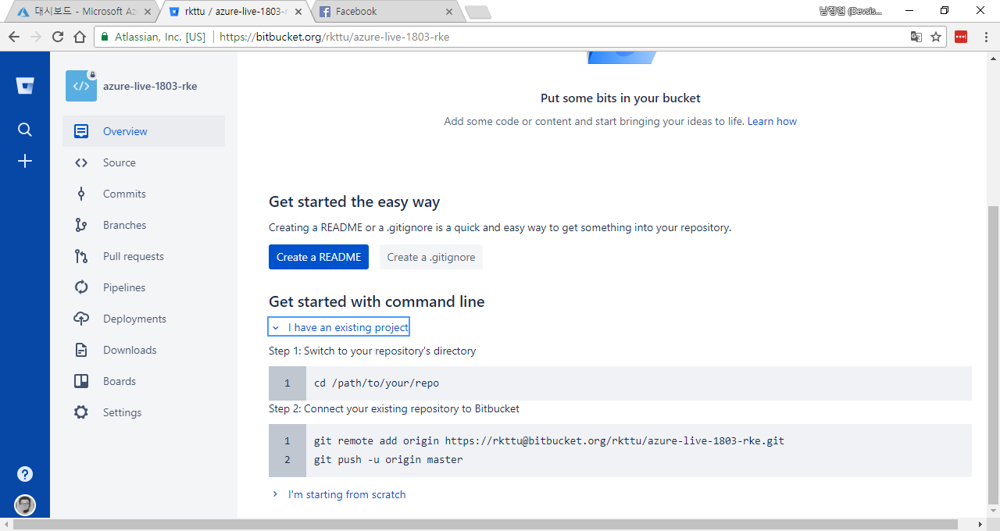
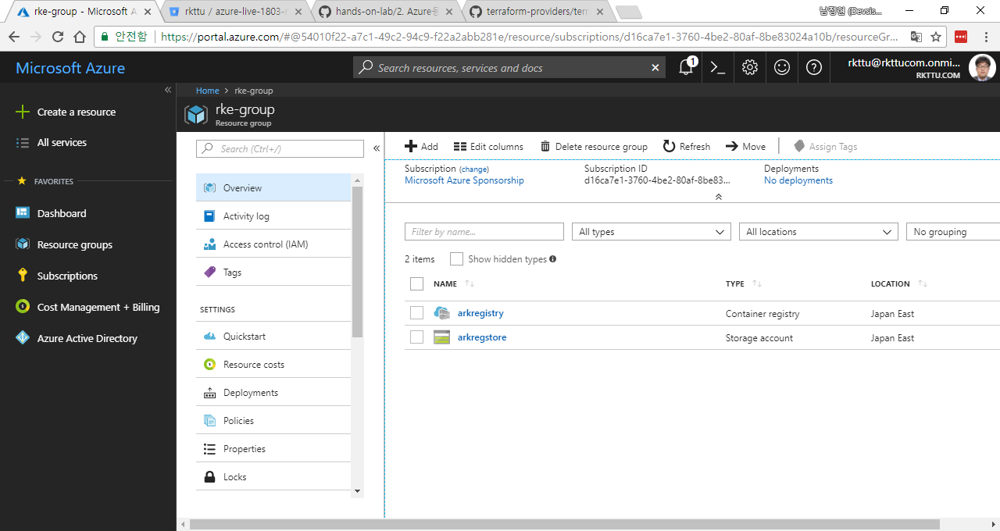

# 2. Azure용 Terraform 사용해보기

이제 Terraform의 기본 사용법을 익혀보도록 하겠습니다.

## 2.1. Terraform 기본 컨셉 살펴보기

Terraform의 문법은 `Hashicorp Configuration Language` 라는 언어의 규격을 따르도록 설계되어있으며, 확장자가 `.tf`인 파일을 여러개 모아놓은 디렉터리를 하나의 프로젝트처럼 취급합니다. 그 중에서, `main.tf` 라는 파일이 시작 위치이며, 이 파일을 중심으로 모든 처리가 이루어집니다.

Terraform이 지원하는 확장 기능들은 `Provider` 라고 지칭하며, 그 중에서 이번 Hands-on-Lab에서는 `Azure Resource Manager Provider`를 위주로 사용합니다.

**NOTE** Azure Resource Manager 기반의 시스템이 만들어지기 이전에 개발된 `Azure Provider`도 있었습니다. 그러나 더 이상 사용되지 않습니다. Provider 이름을 기재할 때 실수하기 쉬우므로 코드에 등장하는 Provider 이름을 숙지하여 주십시오.

Terraform은 원격에 배포한 리소스들의 상태도 State라는 파일 저장소에 같이 보관하며, 배포가 이루어질 때마다 파일 저장소에 실제 리소스들의 마지막 상태를 기록합니다. `Plan` -> `Apply` 의 절차를 거치며, State라는 파일 저장소를 영구적으로 보관할 수 있으면 Azure CLI나 Azure Resource Manager 스크립트를 매번 새로 만들지 않고 손쉽게 인프라를 관리할 수 있습니다.

## 2.2. Terraform 배포 전략 세우기

로컬에서 Terraform 스크립트를 작성하여, Azure Cloud Shell을 이용하여 Terraform을 프로비져닝하고 Post Install을 간편하게 수행할 수 있도록 전략을 세울 것입니다. 이 모듈에서는 다음의 구성 요소들을 Azure 상에 구축할 것입니다.

- 공개되지 않는 사설 Git 저장소 생성 (GitHub Enterprise, BitBucket, Visual Studio Team Service 등 원하는 저장소를 선택하실 수 있습니다. 여기서는 무료로 쉽게 만들어 사용할 수 있는 BitBucket을 기준으로 설명합니다.)
- 작업 전반에 걸쳐 사용할 Private/Public SSH 키 페어 생성 (PuTTYgen 유틸리티 사용)
- Azure Cloud Shell 환경 설정하기

## 2.3. 사설 Git 저장소 만들기

Terraform 파일을 로컬 에디터와 공유하면서 작업하기 편하도록 환경을 구축해야 합니다. GitHub Enterprise나 Bitbucket, Visual Studio Team Service 등의 사설 Git 저장소를 사용할 수 있습니다.

1. 다음 중 하나의 서비스에 가입하여 사설 Git 저장소를 생성하도록 합니다.
    - [GitHub Enterpris](https://www.github.com)
    - [Visual Studio Team Service](https://www.visualstudio.com)
    - [BitBucket](https://www.bitbucket.org)

2. 새로운 Git 리포지터리를 만들 때, 외부에 작업 내용이 노출되지 않도록 Private Repository를 생성합니다. 이 실습 모듈에서는 BitBucket을 기준으로 설명을 진행하겠습니다.

2.1. BitBucket으로 로그인하면 아래와 같이 리포지터리 목록을 조회하는 화면이 나타나게 됩니다. 화면 좌측에 '+' 버튼을 누릅니다.



2.2. 새로 나타나는 메뉴에서 `Repository` 메뉴를 클릭합니다.



2.3. `Access Level` 은 `Private Repository`를 나타내도록 선택하고, 버전 관리 시스템은 `Git`을 선택합니다. 실습의 내용을 따르지 않고 편의에 따라 `Mercurial`을 대신 선택해도 무방하지만, 여기서는 `Git`을 기준으로 설명하겟습니다.


2.4. 새 리포지터리가 만들어지면 사용 방법을 설명하는 가이드가 나옵니다. 링크 하단의 체크아웃 방법을 참고하여 실제 로컬 디렉터리에 체크아웃해보도록 하겠습니다.



2.5. 선호하는 명령 프롬프트 창을 열고, 앞 단계에서 만든 git 리포지터리를 체크아웃해보겠습니다.

```batch
git clone https://your_bitbucket_id@bitbucket.org/your_bit_bucket_id/azure-live-1803-rke.git
cd azure-live-1803-rke
```

2.6. 처음 리포지터리를 체크아웃하였고, 리포지터리에 파일을 제대로 추가할 수 있는지를 테스트해보기 위하여 `README.md` 파일을 새로 만들거나, 파일이 이미 있으면 텍스트 에디터로 열어 임의의 내용을 추가하고 저장합니다.

2.7. 그 다음 `git add README.md` 명령을 입력하여 Git 커밋 대상에 포함시킵니다.

2.8. 그 다음 `git commit -m "Initial commit"` 명령을 입력하여 `Initial Commit` 이라는 메시지를 포함하는 새로운 커밋을 로컬 리포지터리에 추가합니다.

2.9. 그 다음 `git push origin` 명령을 입력하여 BitBucket 리포지터리와 커밋을 동기화합니다. 작업이 완료되면 BitBucket 온라인 리포지터리에도 파일이 변경되거나 추가된 것이 잘 들어있는지 확인합니다. 아래 그림과 같이 화면이 변경되고 `README.md` 파일이 보이면 됩니다.


3. 리포지터리의 주소를 확인한 다음, 로컬 컴퓨터와 `Cloud Shell`의 `~/clouddrive` 디렉터리에 리포지터리를 각각 체크아웃합니다. 이 Hand on Lab 가이드에서는 편의를 위하여 `master` 브랜치로만 작업을 진행할 것입니다.

3.1. 작업의 편의를 위하여 `https://portal.azure.com` 웹 사이트에 로그인하여 포털을 브라우저에 띄우고, 화면 상단 우측의 Cloud Shell 아이콘을 클릭하여 창을 띄웁니다. (아래 그림 참고)


    **TIP** 만약 Cloud Shell을 동시에 여러개를 띄워서 작업하고 싶다면 `https://shell.azure.com` 웹 사이트를 여러번 사용하실 수 있습니다. 단, 가용 리소스에 제약이 있을 수 있으므로 복잡하거나 오래 걸리는 작업이 필요한 경우에는 별도의 리눅스 가상 컴퓨터를 생성하여 사용하는 것이 더 나을 수 있습니다.

    **TIP** 포털 내의 Cloud Shell을 이용하면서 콘솔 창을 종료하는 것이 아니라 잠시 감추고 싶다면 최소화 버튼을 클릭하십시오. 일반 Win32 응용프로그램을 사용할 때 누르는 최소화 버튼과 의미가 같습니다.

    **TIP** 세션에 아무런 상호작용이 없는 경우 30분간 유휴 상태가 유지되다가 자동으로 종료됩니다. 단, 이 모듈에서처럼 사용자가 전개한 오래 걸리는 배치 작업이 있을 경우 지속적으로 tty에 출력이 발생하므로 이 때에는 유휴 시간에 포함되지 않습니다.

3.2. Cloud Shell을 처음 만들면, PowerShell과 Bash 중 어떤 것을 택할지 별도로 물어보는 대화 상자가 나타납니다. 이 때 Bash 셸을 사용하도록 선택합니다. 이 모듈에서 사용하는 모든 도구는 Win32용 어플리케이션이 제공되지만, 실습의 편의를 위하여 Bash 셸을 사용하는 것을 기준으로 설명할 것입니다.

3.3. 사용자 홈 디렉터리의 `clouddrive` 디렉터리는 Cloud Shell 생성과 동시에 초기화되는 별도의 Azure Storage의 File Storage에 마운트되어있고, 여기에 파일을 저장하면 Cloud Shell을 어떤 방식으로 띄우든 무관하게 마지막으로 저장한 내용이 그대로 유지됩니다. 이 디렉터리를 적극 활용할 것입니다.

3.4. 이제 다음과 같이 Cloud Shell 내에서 명령을 입력하겠습니다.

```sh
cd ~/clouddrive
git clone https://your_bitbucket_id@bitbucket.org/your_bit_bucket_id/azure-live-1803-rke.git
cd azure-live-1803-rke
```

3.5. 앞 단계에서 편집한 내용이 그대로 표시되는지 확인해봅니다.

## 2.4. Terraform 스크립트 작성

Terraform 스크립트를 작성하여 Git 저장소에 Push하고, Cloud Shell에서 Pull 하는 과정을 거치도록 하겠습니다.

1. 다음과 같이 `main.tf` 파일을 작성합니다.

`rkttu`라는 문구가 들어간 부분은 실습자 여러분의 개인 아이디로 변경하여 주시기 바랍니다.

```hcl
# 변수 선언
variable arm-prefix {
    default = "rkttu-rke"
}

# 리소스 그룹
resource "azurerm_resource_group" "rke-group" {
    name = "${var.arm-prefix}-group"
    location = "japaneast"
}
```

2. 명령 프롬프트로 로컬에 체크아웃한 디렉터리를 엽니다.

3. 처음 git을 설치한 경우 아래 과정을 거치도록 합니다.

    1. `git config --global user.name 사용자이름` 을 입력하여 커밋할 때 표시될 사용자 이름을 지정합니다.

    2. `git config --global user.email 메일주소` 를 입력하여 커밋할 때 표시될 사용자 메일 주소를 지정합니다.

4. `git add .` 을 입력하여 작업 중인 파일들을 모두 추가합니다.

5. `git commit -m "Add terraform main module"` 을 입력하여 새로운 커밋을 생성합니다.

6. `git push origin` 을 입력하여 원격 저장소와 내용을 동기화합니다.

7. Cloud Shell에 로그인하고, `~/clouddrive` 디렉터리 내에 체크아웃 받은 디렉터리로 이동합니다.

8. `git pull origin` 을 입력하여 원격 저장소의 내용을 동기화합니다.

9. `terraform init` 을 입력하여 Terraform 스크립트 실행을 위한 환경을 자동으로 설정하게 합니다.

10. `terraform plan` 을 입력하여 어떤 내용들이 반영될 것인지를 미리 확인해봅니다.

11. `terraform apply` 를 입력하여 실제로 Azure Resource Manager가 작업을 처리하게 예약합니다. 명령 입력 후 `yes` 를 입력하여 변경에 동의함을 확인합니다.

12. 작업이 오류 없이 완료될 때까지 기다린 후, 포털의 리소스 그룹에 Terraform 스크립트에서 만들도록 요청한 새로운 리소스 그룹이 잘 만들어졌는지 확인해봅니다.

## 2.5. Terraform State 체험해보기

Terraform을 선택하는 이유는 스크립트 자체의 버전 관리가 가능하다는 점 이외에도, 실제 인프라와의 상태를 동기화하여 정보를 가지고 있는 Terraform State를 이용하여 인프라 프로비져닝 작업에 걸리는 시간을 줄이고, 효율적으로 작업할 수 있기 때문입니다.

이 Hands-on-Lab에서는 `~/clouddrive` 디렉터리에 로컬 Terraform State 파일을 보관하도록 하여 간편하게 상태를 보존하는 방식으로 설명을 진행합니다. 필요한 경우 (Azure용 Terraform Backend)[https://www.terraform.io/docs/backends/types/azurerm.html] 를 대신 활용할 수도 있습니다.

Terraform State가 잘 작동하는지 확인하기 위하여 Azure Container Registry 리소스를 추가해보겠습니다.

`rkttu`라는 문구가 들어간 부분은 실습자 여러분의 개인 아이디로 변경하여 주시기 바랍니다.

1. 로컬에서 main.tf 파일의 하단부에 다음의 스크립트 블록을 추가합니다.

```hcl
provider "azurerm" {
    # 만약 자동으로 인증되지 않을 경우 아래 프로퍼티에 값을 추가하고 주석을 해제합니다.
    # subscription_id = ""
    # tenant_id = ""
}

resource "azurerm_resource_group" "rke-group" {
    name = "rke-group"
    location = "japaneast"
}

resource "azurerm_storage_account" "arkregstore" {
    name = "rkttustore"
    location = "japaneast"
    resource_group_name = "${azurerm_resource_group.rke-group.name}"
    account_replication_type = "LRS"
    account_tier = "Standard"
}

resource "azurerm_container_registry" "arkregistry" {
    name = "rkttureg"
    location = "japaneast"
    resource_group_name = "${azurerm_resource_group.rke-group.name}"
    storage_account_id = "${azurerm_storage_account.arkregstore.id}"
}
```

2. `.gitignore` 파일을 추가하고 아래와 같이 코드를 작성합니다.

```text
# Compiled files
*.tfstate
*.tfstate.backup

# Module directory
.terraform/

# IDEA related directory
.idea/

# cluster.yml file (Output)
cluster.yml

# rke binary file
rke_linux-amd64

# PEM, PUB file
*.pem
*.pub
```

3. 파일의 내용을 수정한 다음, `git` 명령으로 내용을 커밋하고 원격 저장소와 커밋을 동기화합니다.

4. 같은 방법으로 Cloud Shell에서 `git` 명령으로 내용을 받아옵니다.

5. `terraform init` 명령을 실행하여 플러그인을 다운로드하고, 실행 환경을 구축합니다.

    **TIP** Azure Cloud Shell과 함께 제공되는 Terraform을 이용하면 Azure Resource Manager 인증 정보를 별도로 제공하지 않고, 안전하고 간편하게 Terraform을 Azure Resource Manager에 연동할 수 있습니다.

6. `terraform plan` 명령을 실행하여, 리소스 그룹 외에 Azure Storage Account와 Azure Container Registry가 생성될 예정이라는 메시지가 정확히 표시되는지 확인합니다.

    **TIP** 만약 자동으로 인증되지 않고 Subscription ID와 Tenant ID를 입력해야 한다는 오류 메시지가 보이면 `provider` 리소스 블록에 `subscription_id`와 `tenant_id` 프로퍼티에 값을 추가합니다. 여기에 지정할 값을 확인하려면 `az account show` 명령을 이용하면 됩니다.

7. `terraform apply` 명령을 실행하고, 결과가 잘 반영되었는지 확인합니다. 실행 확인을 위하여 `yes`를 입력하고 기다립니다. 아래 그림과 같이 포털에 표시가 잘 되면 성공한 것입니다.



8. `terraform destroy` 명령을 실행하여 지금까지 만든 내용을 인프라에서 할당 해제합니다. 실행 확인을 위하여 `yes`를 입력하고 기다립니다. 모두 처리가 완료된 후, 포털에서도 리소스 해제가 잘 되었는지 확인해봅니다.

이와 같은 방식으로 워크플로를 만들어 인프라 관리를 효율적으로 진행할 수 있습니다.

이제 실제로 Rancher를 이용하여 Kubernetes 클러스터를 클라우드 상에 구축해보도록 하겠습니다.
